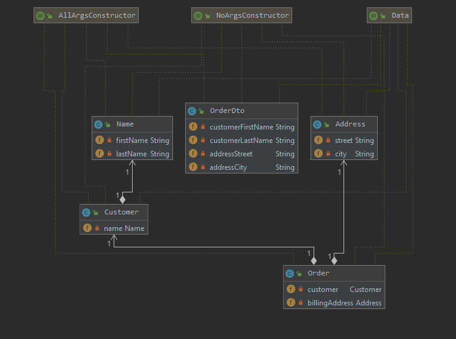
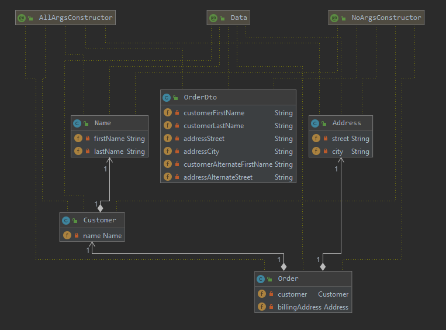

#### ModelMapper

###### ModelMapper.map

The mapping from many entities sources are done automatically to the destination, in this case a Dto.

    destination instance = modelMapper.map( source instance, destination class)

    ModelMapper mapperModel = new ModelMapper();
    OrderDto orderDto = modelMapper.map(order, OrderDto.class);

The JUnit test are as follow 

  [@Test](src/test/java/com.bext.spring/ModelMapperTest.java)
    

###### ModelMapper.typeMap(source class, destination class).addMappings(...)

To add additional mapping to another fields use

		modelMapper.typeMap(Order.class, OrderDto.class).addMappings(mapper -> {
			mapper.map( src -> order.getCustomer().getName().getFirstName(), OrderDto::setCustomerAlternateFirstName);
			mapper.map( src -> order.getBillingAddress().getStreet(), OrderDto::setAddressAlternateStreet);
		});
		
Or alternatively use MatchingStrategy in single line

	    modelMapper.getConfiguration().setMatchingStrategy(MatchingStrategies.LOOSE);		